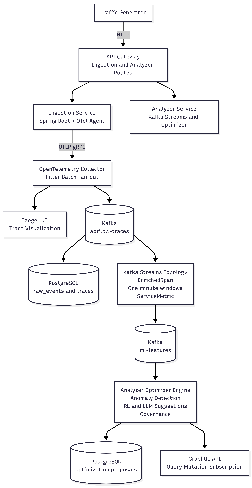
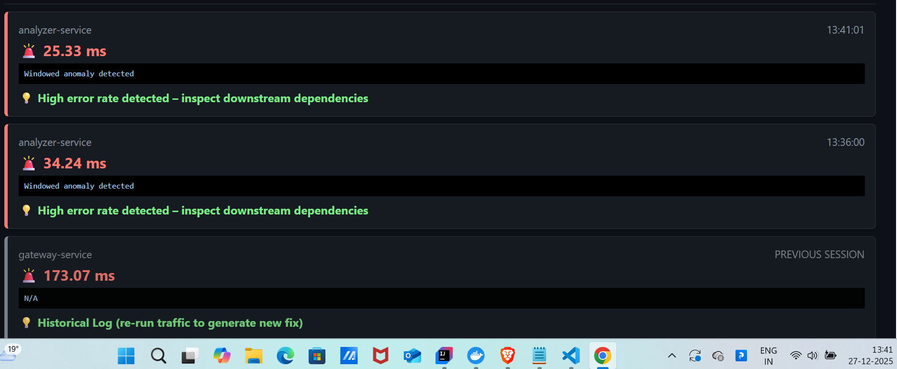
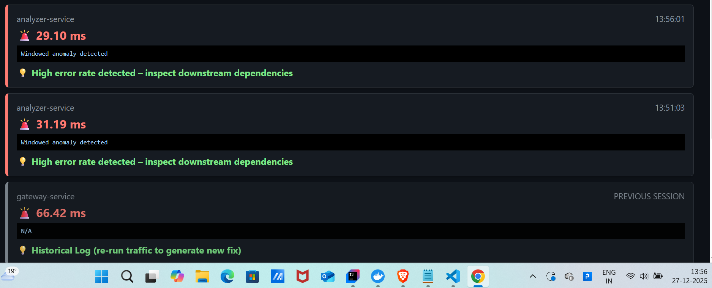

# 🚀 APIFlow: AI-Driven Distributed Tracing & Governance

APIFlow is a high-performance monitoring ecosystem that detects database bottlenecks in real-time using Kafka Streams and provides AI-powered SQL optimization suggestions via GraphQL.


---

## 🏗️ Architecture
APIFlow follows a microservices architecture designed for scale:
* **Ingestion Service**: Collects OpenTelemetry spans and persists them to PostgreSQL.
* **Analyzer Service**: Processes trace streams via Kafka to detect latency anomalies.
* **ML Optimizer**: (Python/Flask) RL Agent that provides SQL rewrite recommendations.
* **Command Center**: A real-time GraphQL-powered dashboard.




---

## 🛠️ Tech Stack

| Component | Technology                                  |
| :--- |:--------------------------------------------|
| **Backend** | Java 17, Spring Boot 3.x                    |
| **Streaming** | Apache Kafka, Kafka Streams                 |
| **API/Real-time** | GraphQL (Queries, Mutations, Subscriptions) |
| **Database** | PostgreSQL                                  |
| **Observability** | OpenTelemetry                               |
| **Infrastructure** | Docker, Terraform                           |

---

## 🚀 How to Run

### Prerequisites
* Docker & Docker Compose
* Java 17+

### Quick Start
1. Clone the repository:
   ```bash
   git clone [https://github.com/vishu2402/APIFlow.git](https://github.com/vishu2402/APIFlow.git)
   cd APIFlow

## 📸 Screenshots

### Real-time Anomaly Detection



